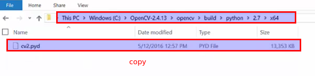
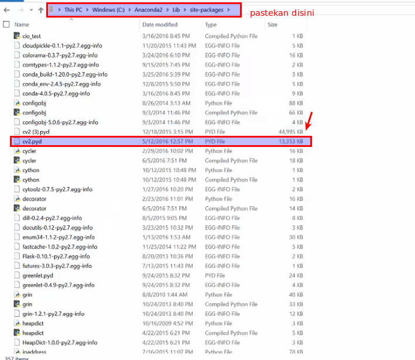
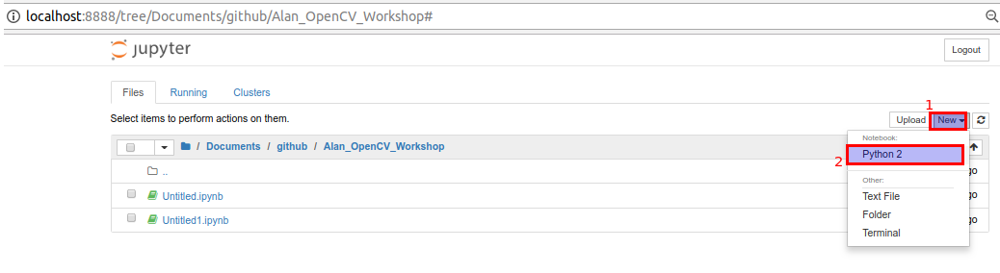
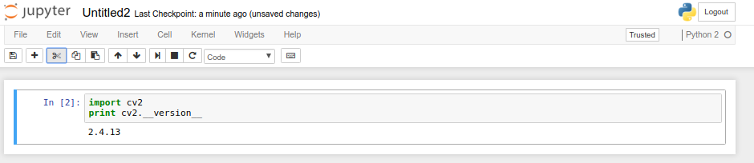

# IoT 101 Image Processing
Belajar image processing menggunakan OpenCV dengan Bahasa Indonesia

# Cara Install Anaconda di Windows 

**STEP 1** - Download & Install Anacondan Python Package
- Pergi ke https://www.anaconda.com/download/
- Pilih versi python 2.7 / 3.5 (workshop ini menggunakan 2.7)
- __TEST Windows__ - Buka CMD dan ketikkan :
    - jupyter notebook

**STEP 2** - Download dan Install OpenCV
- Pergi ke: https://sourceforge.net/projects/opencvlibrary/files/opencv-win/2.4.13/
- Download versi terbaru dari opencv 2.4.13
- Jalankan dan Install opencv yang telah di download

**STEP 3**
- Cari file cv2.py
- file cv2 bisa dicari pada - C:\opencv\build\python\2.7\x64\

**STEP 4**
- Salin file __cv2.py__ ke Instalasi library dimana package anaconda di install

**STEP 5** - Verifikasi

    
   
